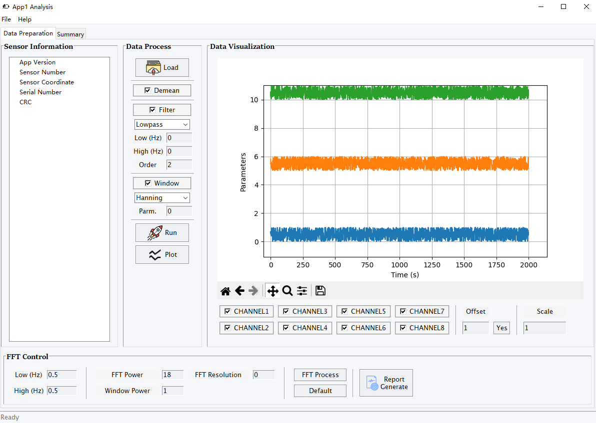
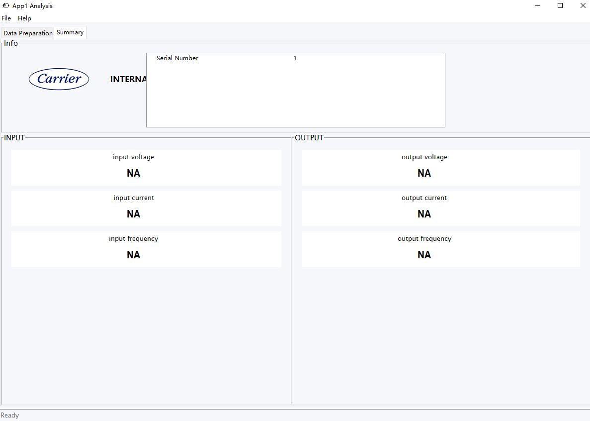
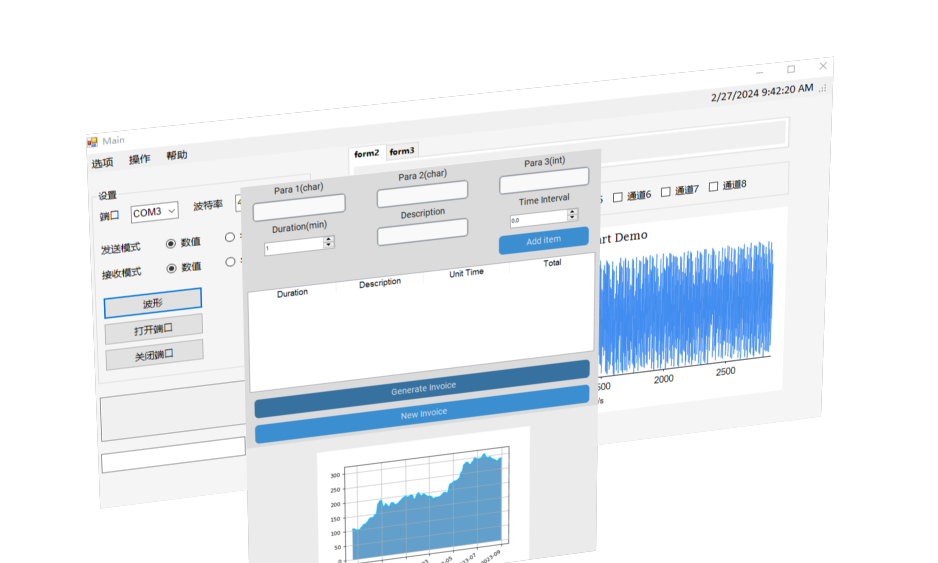
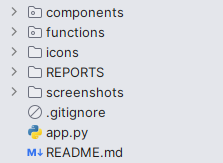
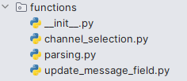

# VFD Health Check & Diagnostic Tool (app ver.)

| Project                | Desc        |
|------------------------|-------------|
| Starting Date          | Jan 1 2024  |
| Last Update            | Apr 29 2024 |
| Current Status         | ACTIVE      |
| Task Holder (Software) | Jin Yue     |

<a href="README_zh_cn.md">简体中文</a>  |  <a href="././screenshots/prep.png">Demo</a>

## 💡 Introduction

This is a desktop analysis application used for VFD health check and diagnostic, providing with a modern pretty UI to users.
Using and customizing standard python packages Tkinter to deal with complex requirements.

Main function design includes:

- Data transmission and display
- Data analysis and diagnostic automatically

## 🗺️ Background

The idea initially comes from the journey of portfolio transformation and getting widespread attention getting data applications. It's all about capturing data and transform it into useful information.

This diagnostic tool is dedicated to the analysis of Variable-frequency Drive (VFD) data and the use of visualization analysis.
It’s going to accomplish:

* VFD life cycle management
* VFD overhaul
* VFD troubleshooting
* VFD commissioning
* other potential needs under user-centered scenarios...

## ✨ Features

<h4>Apr 8 update</h4>

* Editable axis
* Parameter offset and scale setting
* Zooming
* R/W operations

updates 

<h4>March 4 update</h4>
* Concept & schematic construction    
* GUI design and layout    
* Functional parts    
* Multi-channel setup    

## 📋 Structure

Based on class `GlobalVars`, the application customized widgets including `menus`, `canvas`, `tabs`, and their states.
For large and complex applications, breaking into multiple packages and modules makes it easier to manage the code.  

### Components

  
This part relates to the whole interface and elements of it.
Subdirectory are flipping pages, implemented by `ttk.Notebook` such that to customize layouts to each page.

Basically, each individual file below is a rewrite of original tk widgets. For example in `widgets.py`:

For configuration, properties such as `text_color`, `font`, of the widget can be specified and applied globally.

### Functions

  
Functions are actual control that make components working.

### Reports

TBA

### app.py

`GlobalVar` built up, storing global variables. It has two functions:

* set_value: saving variables
* get_value: getting variables

**Run this file to start the app.**

## ▶️ Usage

> Take **tab_data_prepare** as an example.  
> 

This tab has four regions and for each region I used a `LabelFrame` as a container to place different widgets later.

For each label frame, the widget’s position has to be assigned.
Note that Tkinter provides three <a href="https://www.pythonguis.com/faq/pack-place-and-grid-in-tkinter/">geometry managers</a>: `pack`, `grid` and `place`.

Keep adding or customizing widgets to the label frames.

## 🏗️ Related

* <a href="https://wiki.python.org/moin/GuiProgramming">GUI Programming in Python</a>
* <a href="https://matplotlib.org/stable/users/explain/figure/backends.html">Using Matplotlib backends</a>
* <a href="https://tcl.tk/man/tcl8.6/TkCmd/contents.htm">Tk Commands</a>
* <a href="https://pillow.readthedocs.io/en/stable/reference/ImageTk.html">PIL ImageTK Module</a>
